# Predicting Barbell Exercises
- This project was based on [Dave Ebbelaar](https://github.com/daveebbelaar)'s tracking barbell exercises [project](https://github.com/daveebbelaar/tracking-barbell-exercises). He collected the data during gym workouts where participants were performing various barbell exercises using the [Mbientlab's WristBand Sensor Research Kit](https://mbientlab.com/).
- Also, some of the code is associated with the book titled "Machine Learning for the Quantified Self" authored by Mark Hoogendoorn and Burkhardt Funk and published by Springer in 2017. The website of the book can be found on [ml4qs.org](https://ml4qs.org/).
  

# 1. Description
- This is an end-to-end machine learning project that uses Feedforward Neural Network, Random Forest and Simple Decision Tree to predict barbell exercises. It uses accelerometer and gyroscope data collected by a fitness device to predict which exercise was performed and how many repetitions.
- I organized the project development into components responsible for data ingestion, transformation, visualization, model training and evaluation. The entire analysis, from EDA to model training and evaluation, was made in these components, and everything is documented.

# 2. Technologies and tools
- The technologies and tools used were Python (Pandas, Numpy, Matplotlib, Seaborn, Scikit-Learn, Feedforward Neural Networks, Random Forest, Decision Tree, Principal Component Analysis, Low-Pass Filter, Fourier Transformation), Jupyter Notebook, Git and Github (version control), machine learning classification algorithms, statistics, Anaconda (terminal) and Visual Studio Code (project development environment).

# 3. Business problem and project objective

**3.1 What is the business problem?**
- The management team at a fitness device company  is looking to optimize their clients' workout routines and track their progress more effectively. They want to enhance the user experience by accurately predicting the specific barbell exercises performed by the users based on accelerometer and gyroscope data collected from the fitness devices. This predictive tool will enable them to tailor workout plans according to individual needs, monitor exercise consistency, and provide timely feedback to clients for better results, ultimately improving user satisfaction and retention.

**3.2 What is the context?**
- When a person uses a fitness tracker device they collect data through time, such as data from accelerometer and gyroscope sensors, and it is to be expected that the realization of a specific exercise should result a particular pattern in the data.
    1. Accelerometer sensor measures acceleration (rate of change of velocity) forces acting on the device along three axes: X, Y, and Z. It can detect movement, tilt, vibration, and changes in speed.
    2. Gyroscope sensor measures the rate of rotation or angular velocity of the device around its three axes: X, Y, and Z. Provides information and can detect changes about the orientation, angular velocity, and rotational movement of the device.

- We can use the data from these sensors to differentiate between barbell exercises, and build a machine learning model to predict which exercise is being performed by a new instance.
- In order to maintain customer satisfaction and retention, the company whises to accurately label new instances of barbell training exercises from all clients. This will ensure that our fitness device company builds a good relationship with their customers in the sense of helping them structure and track their training routine.

**3.3 What are the project objectives?**
1. Identify exactly which variables contribute to the prediction of barbell exercises.
2. Use feature engineering to perhaps enhance the prediction capabilities of our features.
3. Construct a classification model capable of accurately predicting the probability of the movement being a particular barbell exercise.
4. Offer action plans for the company to avoid mistakes when interpreting the data, to make accurate predictions and preserve customer satisfaction.

**3.4 What are the project benefits?**
- Development of groundbreaking technologies in fitness tracker devices.
- Improved customer satisfaction and retention.
- Improved customer experience.
- Targeted and competitive marketing.

**3.5 Conclusion**
- When deploying the model so that the device can make predictions, the primary objective is to generate probability scores for each set of exercises a customer performs. This is typically more valuable for businesses when compared to making binary predictions (1/0), as it enables better decision-making and more effective interpretation of the data.
- For instance, predicting the probability of it being any specific exercise provides more actionable insights. Instead of simply determining whether a customer is performing exercise A, B or C, you gain an understanding of how likely it is to be each exercise. This information enables the device company to allocate its efforts and resources more effectively.  For instance, if certain exercises are predicted to be less likely to be performed by a particular user demographic, the company can focus its resources on promoting or enhancing those exercises to encourage greater engagement. Conversely, exercises with high predicted probabilities may already be popular among users, prompting the company to invest more resources in refining or expanding related features or content, and so on.

# 4. Solution pipeline
1. Define the business problem.
2. Converting raw data, reading CSV files, cleaning.
3. Explore the data (exploratory data analysis)
4. Feature engineering, data cleaning and preprocessing.
5. Split the data into train and test sets.
6. Model training, comparison, feature selection and tuning.
7. Final production model testing and evaluation.
8. Conclude and interpret the model results.

Further explanation for each step can be found inside the python files, where I provide the rationaly for some decisions made. But here I'll give an overview of what was made in each step, right after I highlight the main business insights.

# 5. Main business insights

# 6. Explaining the approach

**6.1 Define the business problem**
- The definition of the business problem was made in the introduction.

**6.2 Converting raw data, reading CSV files, cleaning**
- The original data collected by the device was separated by participant (5 subjects), type of exercise (Bench Press, Overhead Press, Barbell Row, Squat, Deadlift), category of exercise (medium, 5 reps, or heavy, 10 reps), and whether it is accelerometer or gyroscope data. Each are stored in separate csv files. The first objctive in the `make_dataset.py` file was to extract all these features from the file names and join all of them into a single dataframe.
- The data was collected by the device multiple times a second. So a resample method was used to restructure the data in a way that every instance within 200ms is encompassed together by the mean and becomes the new observation.
- A "set" column was added to the dataframe in the proccess to distinguish between the exercise sets performed by each subject.

**6.3 Explore the data (exploratory data analysis)**
- Analysis of accelerometer data from the x-axis and z-axis reveals clear distinctions among different exercises.

  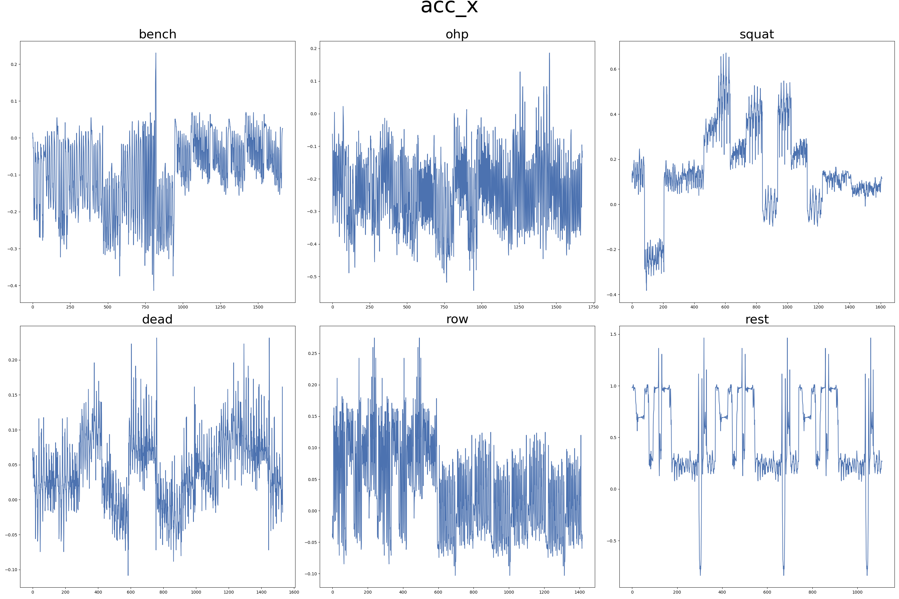
  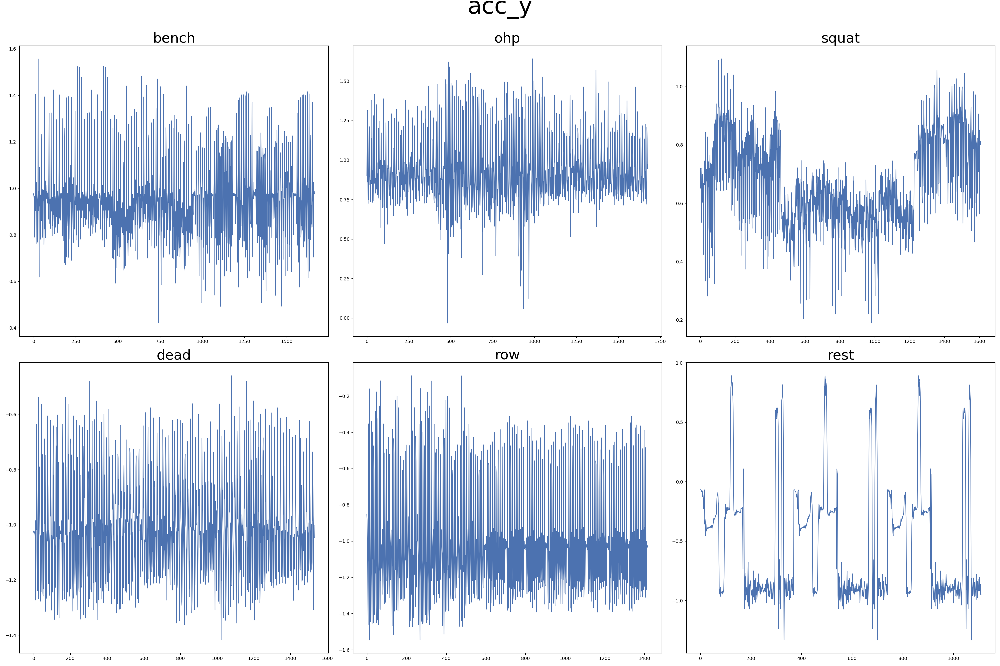
  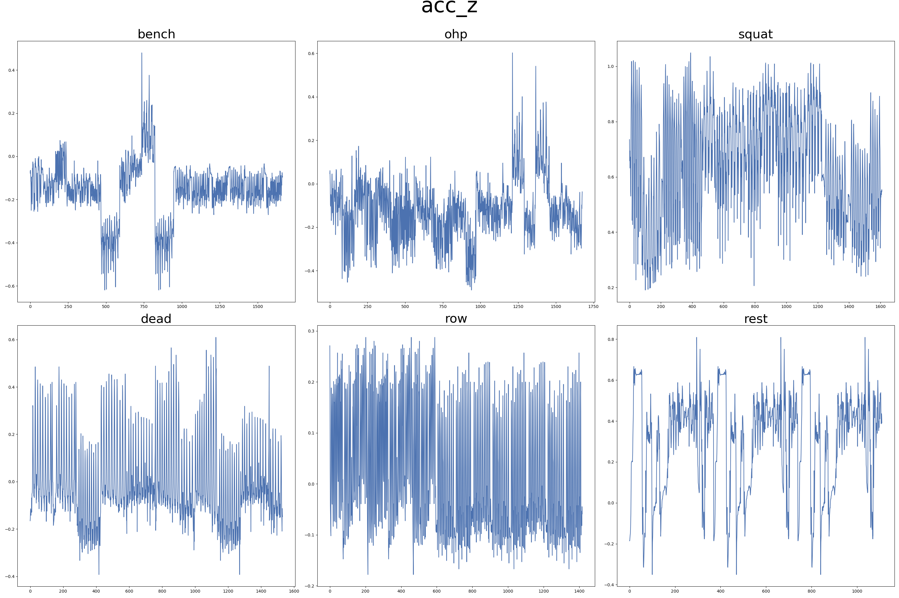 

- Gyroscope data seems to be way more uniform than accelerometer, in a way that we would probably only be able to differentiate between exercises by analysing the amplitude and frequency of the signal, and not only its shape.

- Not all participants performed all exercises. Number of participants per exercise:
Bench Press **5**, Squat **5**, Overhead Press **4**, Barbell Row **4** and Deadlift **3**.

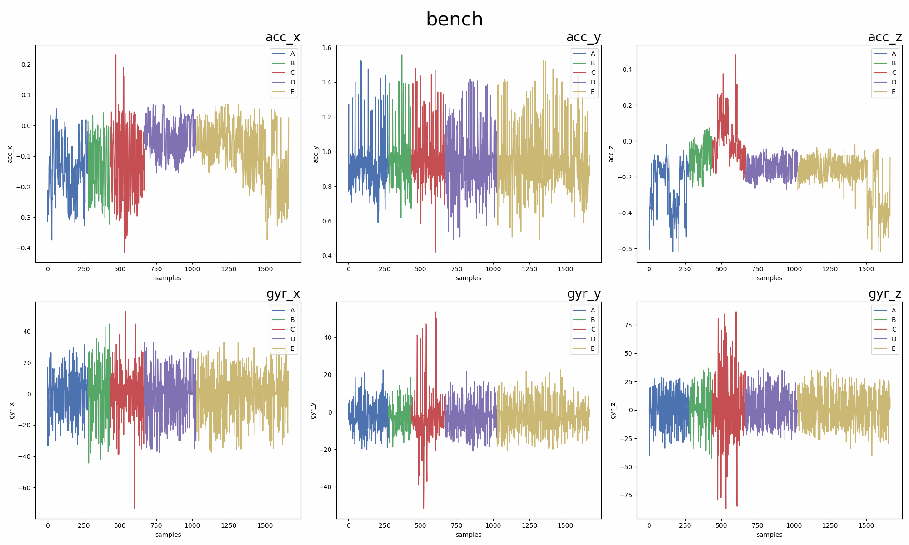

 Images available at reports/figures/acc_gyr_comparison_per_participant/ 

- After segmenting the data based on exercise type and participant, it is apparent that the accelerometer data shows a markedly higher level of dispersion and distinctiveness than the gyroscope data.

  
   
  
  
  

 Images available at reports/figures/acc_gyr_series/ 

**6.4 Feature engineering, data cleaning and preprocessing**

**6.4.1 Outliers**
- In order to remove outliers, we have to check the data distribution because some outlier detection algorithms require a specific distribution (usually normal distribution).
- We can see that the accelerometer data is not normally distributed, but the gyroscope data seems to follow a normal distribution reasonably well.

  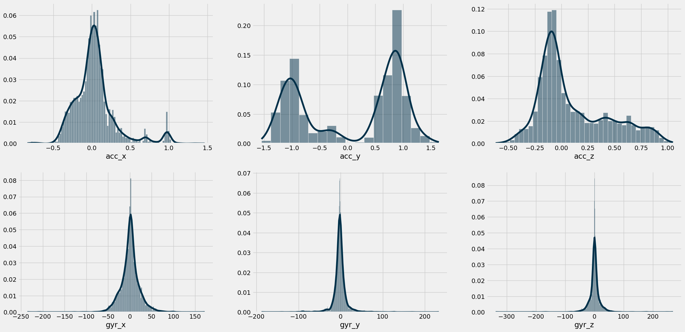

 Image available at reports/figures/distribution/ 

- On top of that, we can run statistical tests to make sure that the data is not normally distributed.

|        | [Shapiro](https://en.wikipedia.org/wiki/Shapiro%E2%80%93Wilk_test)             | [D'Agostino](https://en.wikipedia.org/wiki/D%27Agostino%27s_K-squared_test)              | [Anderson-Darling](https://en.wikipedia.org/wiki/Anderson%E2%80%93Darling_test)         | Distribution                      |
|--------|---------------------|-------------------------|--------------------------|-------------------------------|
| acc_x  | 0.883, p=0.000      | 2506, p=0.000       | 275.302                  | Does not look Gaussian |
| acc_y  | 0.830, p=0.000      | 40635, p=0.000      | 691.349                  | Does not look Gaussian |
| acc_z  | 0.907, p=0.000      | 862, p=0.000        | 351.314                  | Does not look Gaussian |
| gyr_x  | 0.925, p=0.000      | 1713, p=0.000       | 128.498                  | Does not look Gaussian |
| gyr_y  | 0.719, p=0.000      | 2826, p=0.000       | 618.093                  | Does not look Gaussian |
| gyr_z  | 0.691, p=0.000      | 3062, p=0.000       | 586.905                  | Does not look Gaussian |

- In this case, the statistical tests suggests that the data is not normally distributed, not even the gyroscope data. It could be due to our large sample set. As we have already visualized the distribution of the accelerometer data and saw that it is not normally distributed, we will use methods to detect and remove outliers that do not assume a particular distribution. I will use a few methods that are not distribution based, such as: **IQR**, **Isolation Forest** and **Local Outlier Factor**.

  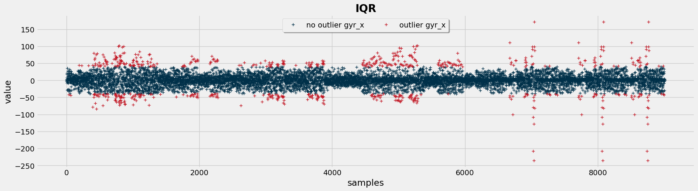
  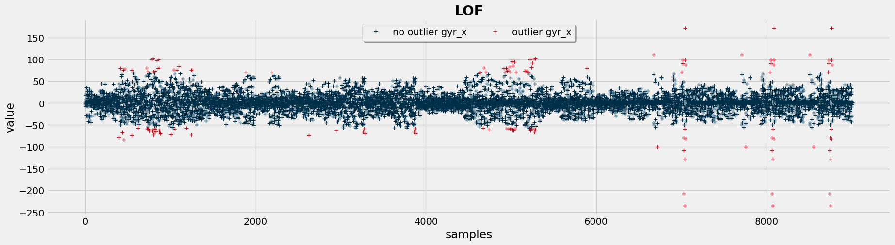
  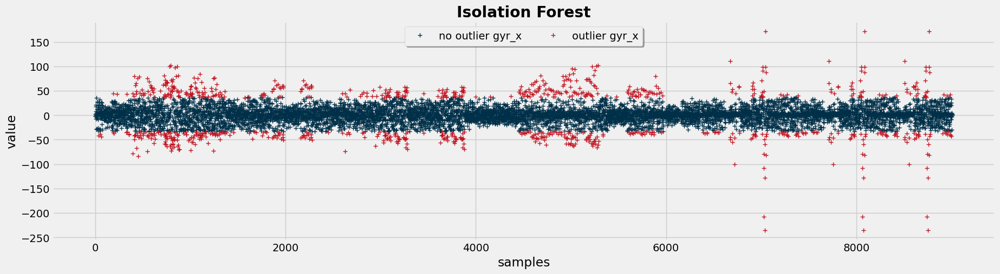

 Images available at reports/figures/outliers/ 

- I will choose the **Local Outlier Factor (LOF)** method as it seems to be less agressive than the others and also it considers the idea of local distribution of the neighboring points to determine outliers.

- To be less aggressive and keep as much information as possible, we want to consider for the LOF method a number of `n_neighbors` that removes as few outliers as possible. Running a simple loop we can evaluate that.

  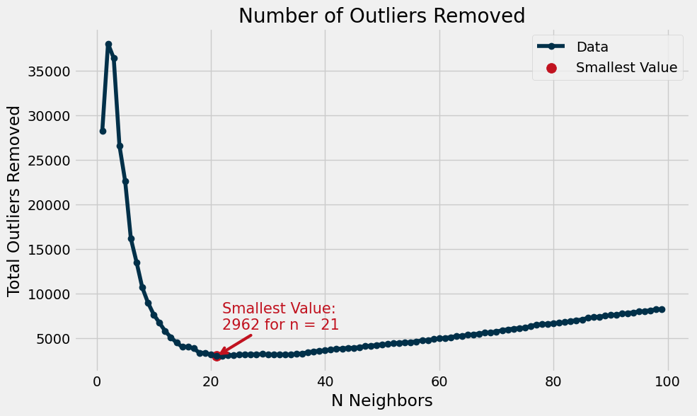

 Images available at reports/figures/outliers/ 

**6.4.1 Feature Engineering**

- A [**Low-Pass Filter**](https://en.wikipedia.org/wiki/Butterworth_filter) was performed on the original features to reduce high frequency data. The idea is that the curves get "smoother", and we no longer have as much "noise", only the overall tendency.

>"The lowpass filter can be applied to data that is of temporal nature, and assumes that there is a form of periodicity. Think about accelerometer data for example, if we are walking, we will see periodic measurements in our accelerometer data at a frequency around 1Hz as walking is a repetitive pattern. When we process our data, we can filter out such periodic constituents based upon their frequency. We could say for instance that any measurement we perform that is at a higher frequency than our walking behavior is irrelevant and can be considered as noise (they might actually hamper our machine learning process).
>
> — <cite>Hoogendoorn, M., & Funk, B. (2018). Machine learning for the quantified self. On the art of learning from sensory data. Pg. 38.</cite>

  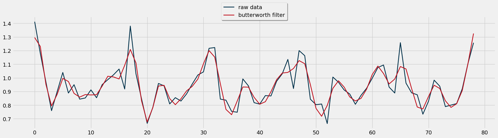

 Images available at reports/figures/feature_engineering/ 

- A [**Principal Component Analysis (PCA)**](https://en.wikipedia.org/wiki/Principal_component_analysis) was performed to encompass the effect of the original features into three PCA components (dimensionaly reduction). The optimal number of components was determined using the [elbow method](https://en.wikipedia.org/wiki/Elbow_method_(clustering)).

- [**Temporal Abstraction**](https://en.wikipedia.org/wiki/Moving_average) was employed to determine moving averages and moving standard deviations from the raw features. This process involved averaging or calculating standard deviations across a sliding window of n previous observations to generate our values.

  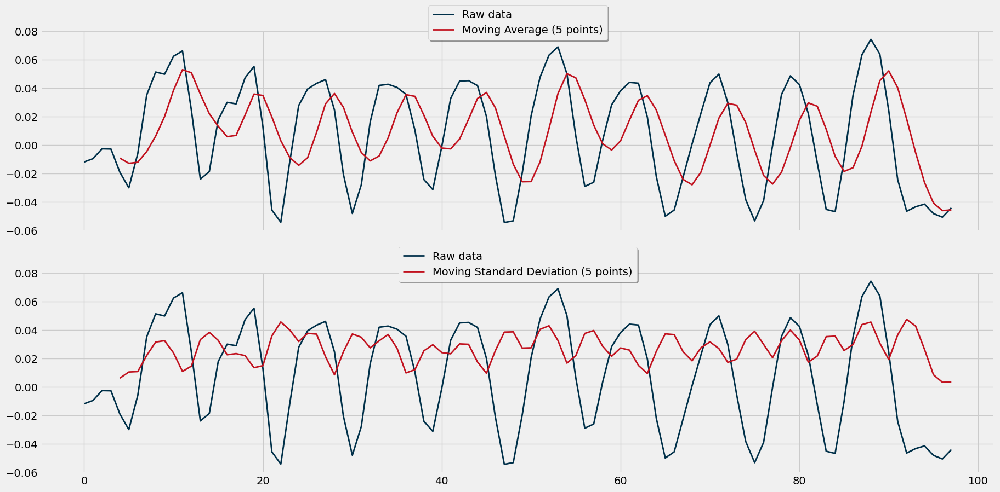

 Images available at reports/figures/feature_engineering/ 

- A [**Discrete Fourier Transform**](https://en.wikipedia.org/wiki/Discrete_Fourier_transform) was used to break down the original curves into simpler patterns that capture the same behavior. It's like dissecting a complex puzzle into smaller pieces, each revealing part of the bigger picture. This way, we can hopefully expect to find a curve that will explain the target variable better than the original apparent noisy curve.

  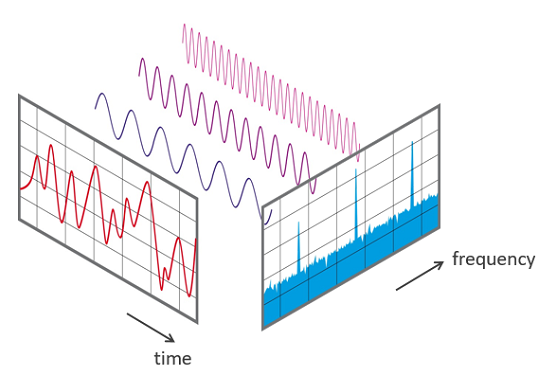

 Images available at reports/figures/feature_engineering/ 

- Applied the [**K-Means Clustering**](https://en.wikipedia.org/wiki/K-means_clustering) algorithm to group similar data points. The optimal number of clusters was determined using the elbow method. While some clusters accurately represent certain exercises, others are less distinguishable when compared with the actual labeled data.

  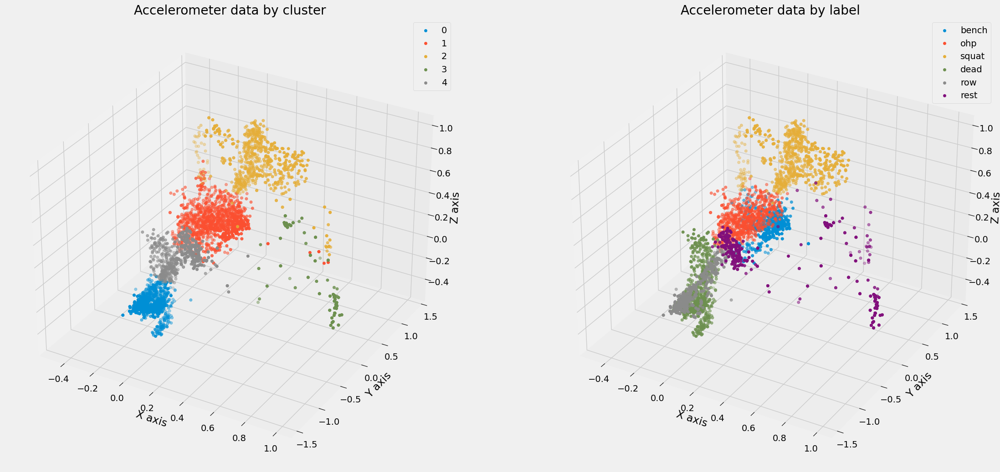

 Images available at reports/figures/feature_engineering/ 

**6.5 Split the data into train and test sets**

The train-test split was performed in a way that **75%** of the observations were used for the training set, and **25%** for the test set. The target variable was also used as a stratify parameter, to make sure that the proportion of labels remains roughly the same in both sets.

**6.6 Model training, comparison, feature selection and tuning**

- The engineered features were organized into separate lists and used to train the model. Subsequently, the model's performance was assessed for each feature set. This was done to understand whether the feature engineering efforts were paid off. One of the feature sets was obtained using a forward selection algorithm, to determine the **10** best performing features (evaluated using a simple decision tree).

- The models used to classify the exercises were the following: **Random Forest** (RF), **Decision Tree** (DT), **Neural Networks** (NN), **Naive Bayes** (NB) and **K-Nearest Neighbors** (KNN).

- My best results were the following

| model | feature_set        | accuracy |
|-------|--------------------|----------|
| **RF**    | selected_features  | 0.997932 |
| **RF**    | feature_set_4      | 0.996898 |
| **NN**    | feature_set_4      | 0.995863 |
| **DT**    | selected_features  | 0.994829 |
| **NN**    | feature_set_3      | 0.989659 |

 Feature sets available at src/models/train_model.py/ 

  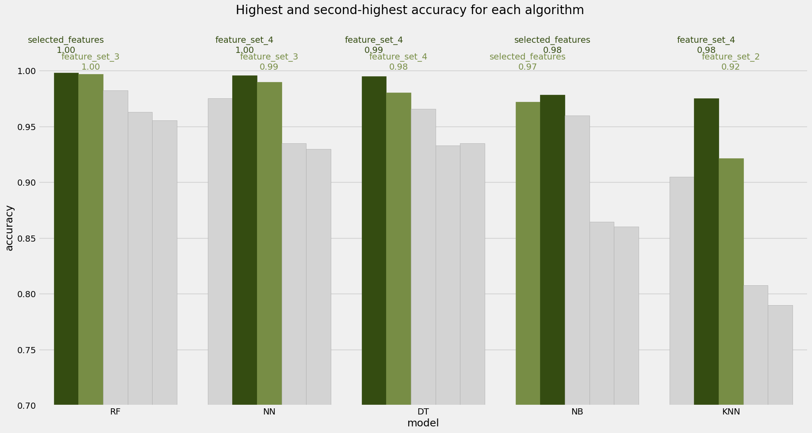
  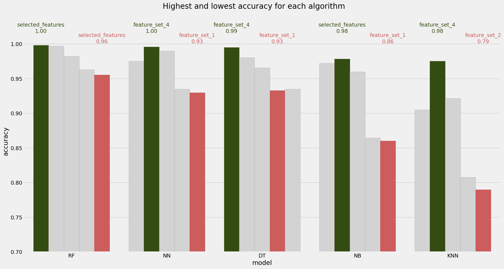

 Images available at reports/figures/models/ 

- I selected the best performing one (**RF - selected_features**) and trained the model again using **gridsearch**. The gridsearch was used to evaluate the best performance of the random forest model on the following parameters: the number of trees in the forest (**n_estimators**), the minimum number of samples required to be at a leaf node (**min_samples_leaf**) and the criterion (**gini and entropy**). The results were good and are shown in the following confusion matrix.

  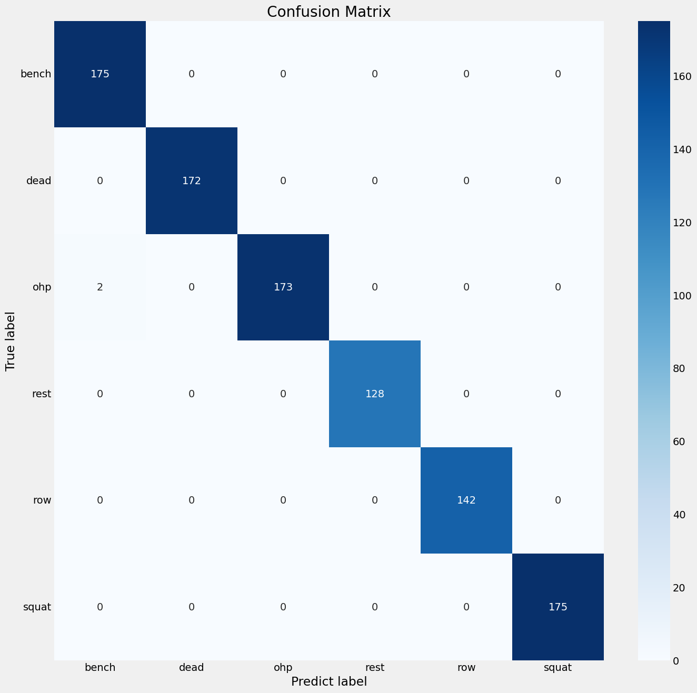

 Images available at reports/figures/models/ 

**6.7 Final production model testing and evaluation**

- Although good results were obtained, there is one thing that could be improved. The models were trained using data from all participants, which could be causing some data leakage, as the model could be evaluating its performance on a given observation in the test set and nourishing good returns as it had already trained using data from that particular participant in the training set.

- Now we are going to train the model again but we will do it without using any data
from participant `A`, and then we will evaluate the model solely using features from
this participant.

- We are doing this, of course, to ensure that our model is able to generalize its 
good prediction capabilities to really new data (as if a new participant appeared to 
use our fitness tracker device).

- The results were also exceptional. The model is able to generalize its prediction capabilities to new data.

  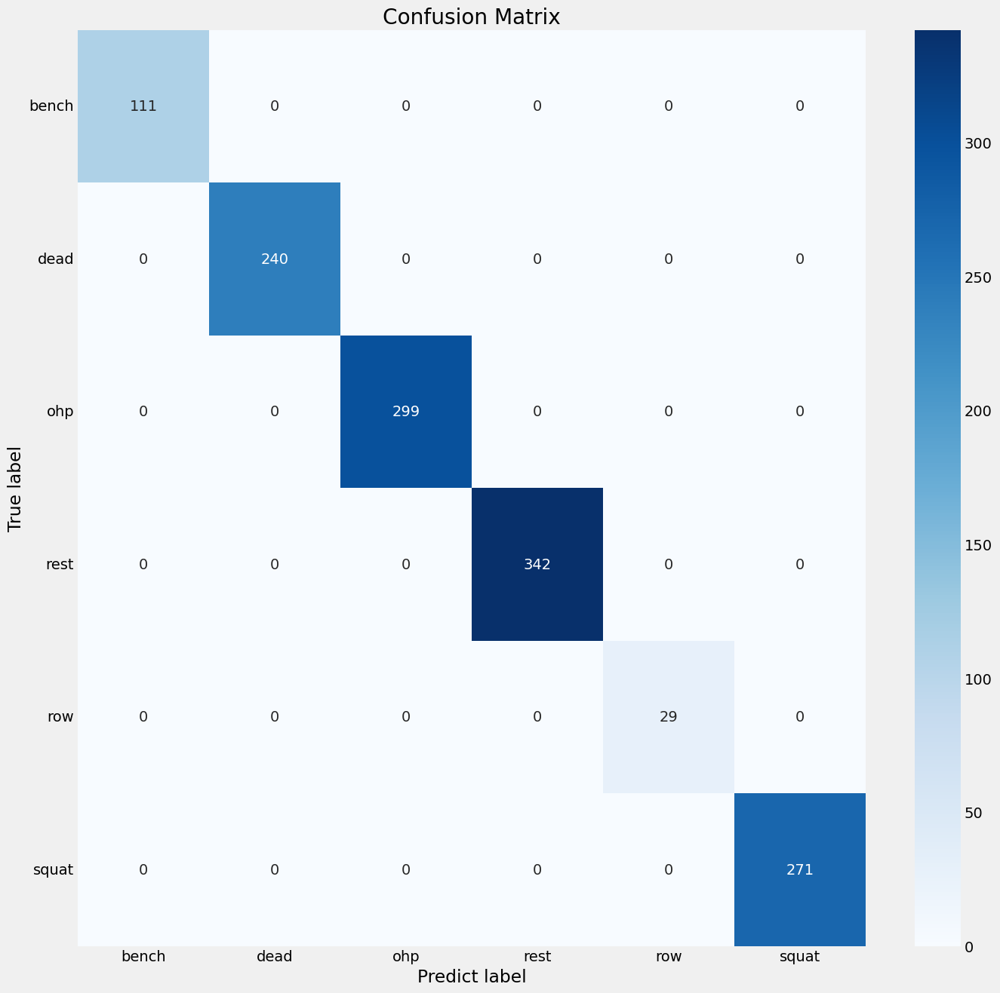

 Images available at reports/figures/models/ 

